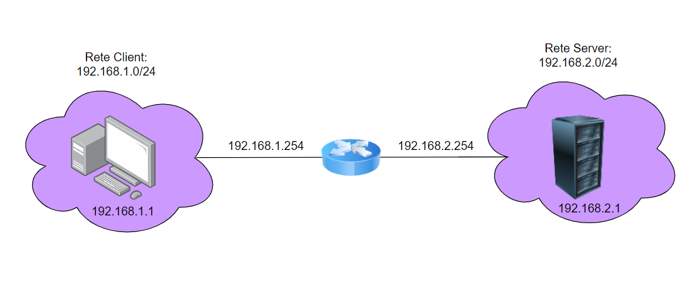

# Media Esami

Applicativo basato su **socket UDP**.

Il Client può:
- Registrare un nuovo esame
- Conoscere la media dei suoi voti

Il Server dovrà:
- Memorizzare i voti degli esami del client
- Restituire la media dei voti del client

Il server dovrà inoltre stampare a video lo storico delle scelte effettuate dal Client come da esempio:

```bash
[Client: 192.168.56.107] Vuole aggiungere un nuovo esame
[Client: 192.168.56.107] Vuole sapere la media dei voti
[Client: 192.168.56.107] Vuole aggiungere un nuovo esame
[Client: 192.168.56.107] Vuole sapere la media dei voti
```

# Networking IPv4



# Istruzioni di configurazione

* **Client 1**

    1) Creare su VirtualBox una scheda di rete settata come **rete interna** e denominata **lan1**

    2) Creare su VirtualBox una scheda di rete settata come **scheda solo host** per potersi connettere tramite SSH

    3) Settare la **scheda di rete**
        ```bash
        # nano /etc/network/interfaces

        allow-hotplug enp0s3
        iface enp0s3 inet static
        address 192.168.1.1/24
        gateway 192.168.1.254

        # Scheda 'solo host' per connettersi tramite SSH

        allow-hotplug enp0s8
        iface enp0s8 inet dhcp
        ```

* **Server**

    1) Creare su VirtualBox una scheda di rete settata come **rete interna** e denominata **lan2**

    2) Creare su VirtualBox una scheda di rete settata come **scheda solo host** per potersi connettere tramite SSH

    2) Settare la **scheda di rete**
        ```bash
        # nano /etc/network/interfaces

        allow-hotplug enp0s3
        iface enp0s3 inet static
        address 192.168.2.1/24
        gateway 192.168.2.254

        # Scheda 'solo host' per connettersi tramite SSH

        allow-hotplug enp0s8
        iface enp0s8 inet dhcp
        ```

* **Router**

    1) Creare su VirtualBox le seguenti schede di rete:
        * una scheda di rete settata come **rete interna** e denominata **lan1**
        * una scheda di rete settata come **rete interna** e denominata **lan2**

    2) Settare le **schede di rete**
        ```bash
        # nano /etc/network/interfaces

        allow-hotplug enp0s3
        iface enp0s3 inet static
        address 192.168.1.254/24

        allow-hotplug enp0s8
        iface enp0s8 inet static
        address 192.168.2.254/24
        ```

     3) Abilitare l'**inoltro dei pacchetti**
        ```bash
        # nano /etc/sysctl.conf

        net.ipv4.ip_forward=1
        ```

# Verifica del funzionamento

 1) Modificare il file **etc/hosts** di **Client1** nel seguente modo:

    ```bash
        # nano /etc/hosts

        127.0.0.1       localhost
        127.0.0.1       debian
        192.168.2.1     server
        192.168.1.254   router
    ```
 2) Eseguire il comando **ping / traceroute** per verificare il collegamento:

    ```bash
        ping server

        # alternativa:

        ping 192.168.2.1

        # alternativa:

        traceroute server

        # Risultato atteso:
        traceroute to server (192.168.2.1), 30 hops max, 60 byte packets
        1 router (192.168.1.254) 0.527 ms 0.496 ms 0.489 ms
        2 server (192.168.2.1) 1.166 ms 1.330 ms *
     ```