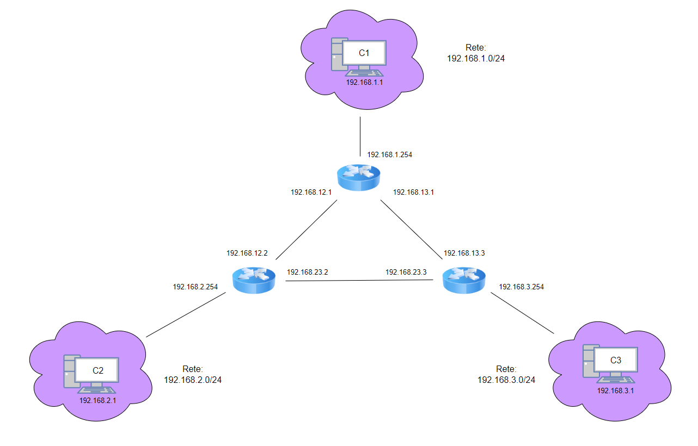

# Networking IPv4



# Istruzioni di configurazione

* **Client 1**

    1) Creare su VirtualBox una scheda di rete settata come **rete interna** e denominata **lan1**

    2) Settare la **scheda di rete**
        ```bash
        # nano /etc/network/interfaces

        allow-hotplug enp0s3
        iface enp0s3 inet static
        address 192.168.1.1/24
        gateway 192.168.1.254
        ```

* **Client 2**

    1) Creare su VirtualBox una scheda di rete settata come **rete interna** e denominata **lan2**

    2) Settare la **scheda di rete**
        ```bash
        # nano /etc/network/interfaces

        allow-hotplug enp0s3
        iface enp0s3 inet static
        address 192.168.2.1/24
        gateway 192.168.2.254
        ```

* **Client 3**

    1) Creare su VirtualBox una scheda di rete settata come **rete interna** e denominata **lan3**

    2) Settare la **scheda di rete**
        ```bash
        # nano /etc/network/interfaces

        allow-hotplug enp0s3
        iface enp0s3 inet static
        address 192.168.3.1/24
        gateway 192.168.3.254
        ```

* **Router 1**

    1) Creare su VirtualBox le seguenti schede di rete:
        * una scheda di rete settata come **rete interna** e denominata **lan1**
        * una scheda di rete settata come **rete interna** e denominata **lan12**
        * una scheda di rete settata come **rete interna** e denominata **lan13**

    2) Settare le **schede di rete**
        ```bash
        # nano /etc/network/interfaces

        allow-hotplug enp0s3
        iface enp0s3 inet static
        address 192.168.1.254/24

        allow-hotplug enp0s8
        iface enp0s8 inet static
        address 192.168.12.1/24
        up ip route add 192.168.2.0/24 via 192.168.12.2

        allow-hotplug enp0s9
        iface enp0s9 inet static
        address 192.168.13.1/24
        up ip route add 192.168.3.0/24 via 192.168.13.3
        ```

     3) Abilitare l'**inoltro dei pacchetti**
        ```bash
        # nano /etc/sysctl.conf

        net.ipv4.ip_forward=1
        ```

* **Router 2**

    1) Creare su VirtualBox le seguenti schede di rete:
        * una scheda di rete settata come **rete interna** e denominata **lan2**
        * una scheda di rete settata come **rete interna** e denominata **lan12**
        * una scheda di rete settata come **rete interna** e denominata **lan23**

    2) Settare le **schede di rete**
        ```bash
        # nano /etc/network/interfaces

        allow-hotplug enp0s3
        iface enp0s3 inet static
        address 192.168.2.254/24

        allow-hotplug enp0s8
        iface enp0s8 inet static
        address 192.168.12.2/24
        up ip route add 192.168.1.0/24 via 192.168.12.1

        allow-hotplug enp0s9
        iface enp0s9 inet static
        address 192.168.23.2/24
        up ip route add 192.168.3.0/24 via 192.168.23.3
        ```

     3) Abilitare l'**inoltro dei pacchetti**
        ```bash
        # nano /etc/sysctl.conf

        net.ipv4.ip_forward=1
        ```

* **Router 3**

    1) Creare su VirtualBox le seguenti schede di rete:
        * una scheda di rete settata come **rete interna** e denominata **lan3**
        * una scheda di rete settata come **rete interna** e denominata **lan13**
        * una scheda di rete settata come **rete interna** e denominata **lan23**

    2) Settare le **schede di rete**
        ```bash
        # nano /etc/network/interfaces

        allow-hotplug enp0s3
        iface enp0s3 inet static
        address 192.168.3.254/24

        allow-hotplug enp0s8
        iface enp0s8 inet static
        address 192.168.23.3/24
        up ip route add 192.168.2.0/24 via 192.168.23.2

        allow-hotplug enp0s9
        iface enp0s9 inet static
        address 192.168.13.3/24
        up ip route add 192.168.1.0/24 via 192.168.13.1
        ```

     3) Abilitare l'**inoltro dei pacchetti**
        ```bash
        # nano /etc/sysctl.conf

        net.ipv4.ip_forward=1
        ```

# Verifica del funzionamento

 1) Modificare il file **etc/hosts** di **Client1** nel seguente modo:

    ```bash
        # nano /etc/hosts

        127.0.0.1       localhost
        127.0.0.1       debian
        192.168.2.1     client2
        192.168.3.1     client3
        192.168.1.254   router1
        192.168.12.2    router2
        192.168.13.3    router3
    ```
 2) Eseguire il comando **ping / traceroute** per verificare il collegamento:

    ```bash
        ping client3

        # alternativa:

        ping 192.168.3.1

        # alternativa:

        traceroute client3

        # Risultato atteso:
        traceroute to client3 (192.168.3.1), 30 hops max, 60 byte packets
        1 router1 (192.168.1.254) 0.527 ms 0.496 ms 0.489 ms
        2 router3 (192.168.13.3) 0.788 ms 0.780 ms 0.772 ms
        3 client3 (192.168.3.1) 1.166 ms 1.330 ms *
     ```