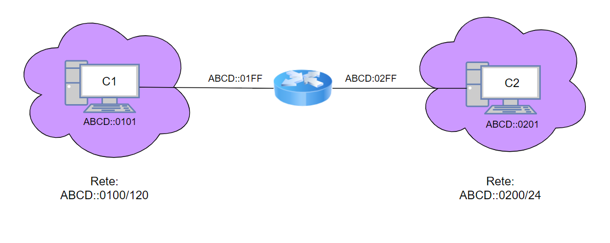

# Networking IPv6



# Istruzioni di configurazione

* **Client 1**

    1) Creare su VirtualBox una scheda di rete settata come **rete interna** e denominata **lan1**

    2) Settare la **scheda di rete**
        ```bash
        # nano /etc/network/interfaces

        allow-hotplug enp0s3
        iface enp0s3 inet6 static
        address ABCD::0101/120
        gateway ABCD::01FF
        ```

* **Client 2**

    1) Creare su VirtualBox una scheda di rete settata come **rete interna** e denominata **lan2**

    2) Settare la **scheda di rete**
        ```bash
        # nano /etc/network/interfaces

        allow-hotplug enp0s3
        iface enp0s3 inet6 static
        address ABCD::0201/120
        gateway ABCD::02FF
        ```
* **Router**

    1) Creare su VirtualBox le seguenti schede di rete:
        * una scheda di rete settata come **rete interna** e denominata **lan1**
        * una scheda di rete settata come **rete interna** e denominata **lan2**

    2) Settare le **schede di rete**
        ```bash
        # nano /etc/network/interfaces

        allow-hotplug enp0s3
        iface enp0s3 inet6 static
        address ABCD::01FF/120

        allow-hotplug enp0s8
        iface enp0s8 inet6 static
        address ABCD::02FF/120
        ```

     3) Abilitare l'**inoltro dei pacchetti**
        ```bash
        # nano /etc/sysctl.conf

        net.ipv6.conf.all.forwarding=1
        ```

# Verifica del funzionamento

 1) Modificare il file **etc/hosts** di **Client1** nel seguente modo:

    ```bash
        # nano /etc/hosts

        127.0.0.1       localhost
        127.0.0.1       debian
        ABCD::0201      client2
        ABCD::01FF      router
    ```
 2) Eseguire il comando **ping / traceroute** per verificare il collegamento:

    ```bash
        ping client2

        # alternativa:

        ping ABCD::0201

        # alternativa:

        traceroute client2

        # Risultato atteso:
        traceroute to client2 (abcd::201), 30 hops max, 60 byte packets
        1 router (abcd::1ff) 0.527 ms 0.496 ms 0.489 ms
        2 client2 (abcd::101) 0.788 ms 0.780 ms 0.773 ms
     ```
