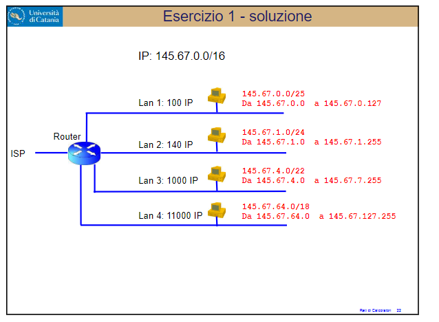

# Routing - Esercizio sulla configurazione di una rete con 4 LAN

<p align="center">
    
</p>

1. **Creare 5 VM** chiamate: L1, L2, L3, L4, R
2. Impostare le macchine come **rete interna**
3. **Abilitare 4 schede di rete** nella macchina **'R'**

# Come settare le 5 macchine virtuali

* **Cambiamo il nome in tutte le macchine virtuali**

    ```bash
    # Effettuare l'accesso come amministratore (root)

    cd /etc # Cartella con i file di configurazione di sistema

    nano hostname # Apre il file dove è inserito il nome della macchina virtuale

    # Modificare 'debian' con il nuovo nome della macchina virtuale (L1, L2, L3, L4, R)
    
    # Salvare (CTRL+O)
    # Chiudere il file (CTRL+X)

    reboot # Serve a riavviare la macchina virtuale
    ```

* **Come configurare L1**
    ```bash
    # --- Aggiungere un indirizzo IP --- #
    
    ip addr add 145.67.0.1/25 dev enp0s3

    # --- Aggiungere gateway di default --- #

    ip route add default via 145.67.0.126 dev enp0s3
    ```

* **Come configurare L2**
    ```bash
    # --- Aggiungere un indirizzo IP --- #
    
    ip addr add 145.67.1.1/24 dev enp0s3

    # --- Aggiungere gateway di default --- #

    ip route add default via 145.67.1.254 dev enp0s3
    ```

* **Come configurare L3**
    ```bash
    # --- Aggiungere un indirizzo IP --- #
    
    ip addr add 145.67.4.1/22 dev enp0s3

    # --- Aggiungere gateway di default --- #

    ip route add default via 145.67.7.254 dev enp0s3
    ```

* **Come configurare L4**
    ```bash
    # --- Aggiungere un indirizzo IP --- #
    
    ip addr add 145.67.64.1/18 dev enp0s3

    # --- Aggiungere gateway di default --- #

    ip route add default via 145.67.127.254 dev enp0s3
    ```

* **Come configurare R**
    ```bash
    # --- Abilitare le schede di rete --- #

    ip link set enp0s8 up
    ip link set enp0s9 up
    ip link set enp0s10 up

    # --- Aggiungere gli indirizzi IP --- #
    
    ip addr add 145.67.0.126/25 dev enp0s3
    ip addr add 145.67.1.254/24 dev enp0s8
    ip addr add 145.67.7.254/22 dev enp0s9
    ip addr add 145.67.127.254/18 dev enp0s10

    # --- Abilitiamo IP forwarding  --- #

    cd /etc # Cartella con i file di configurazione del sistema
    nano sysctl.conf # File di configurazione del sistema

    # Abilitare 'net.ipv4.ip_forward=1' cancellando il carattere '#' prima della stringa
    
    # Salvare (CTRL+O)
    # Chiudere il file (CTRL+X)
    ```

# Effettuiamo il test facendo comunicare L1 ed L2

* **Eseguiamo il seguente comando nella macchina L1**

    ```bash
    ping -c 6 145.67.1.1/24 # Invia 6 pacchetti ad L2
    ```

* **Eseguiamo il seguente comando nella macchina L2**

    ```bash
    ping -c 6 145.67.0.1/25 # Invia 6 pacchetti ad L1
    ```